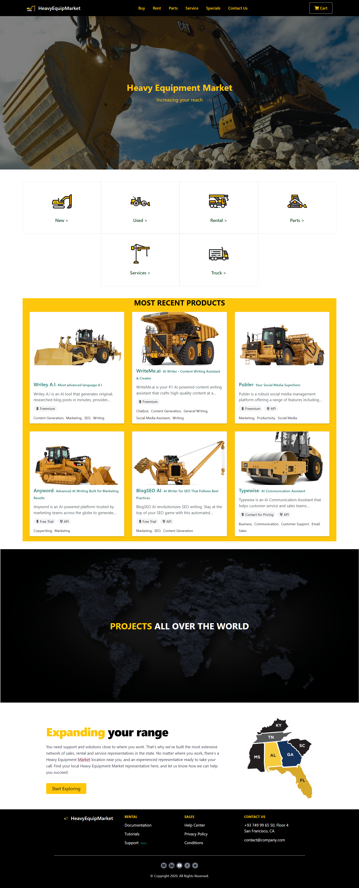
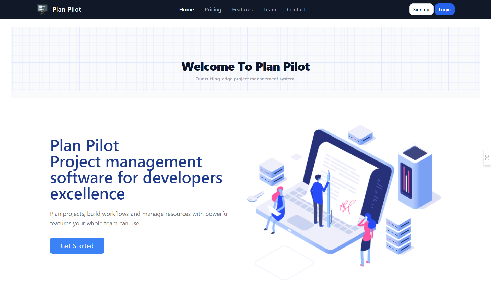
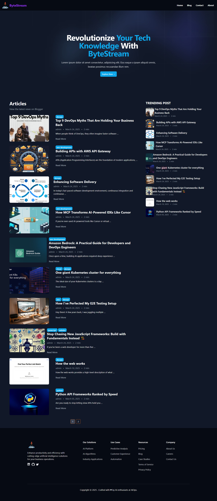

## Hey 👋, I'm Mahmoud Essam!

 

I’m a versatilist who seamlessly adapts to various roles—including full-stack web development 🌐—based on the needs of each project. I have a strong passion for exploring new technologies 💻 and enjoy leveraging them to build innovative and impactful solutions 🛠️.
 
 

  
### 🧐 More About Me:

- 🔭 &nbsp; I’m currently working on **project-management-app**
- 🌱 &nbsp; I’m currently learning DevOps; 
- 👨🏻‍💻 &nbsp; Most of my projects are available on [Github](https://github.com/mahmoudessam820?tab=repositories)
- 💬 &nbsp; Ask me about anything tech related, I am happy to help;
- 📫 &nbsp; Feel free to ping me on [LinkedIn](https://www.linkedin.com/in/mahmoud-essam-822719149/)
- 📝 &nbsp; Checkout my [portfolio](https://clear-sleet.surge.sh/)
- 📝 &nbsp; I regularly write articles and solve problems on [Dev.to](https://dev.to/mahmoudessam)

 

 

### 🔨 Languages and Tools:
<!-- HTML -->

<!-- CSS -->

<!-- JavaScript -->

<!-- Vue.js -->

<!-- Python -->

<!-- Django -->

<!-- FastAPI -->

<!-- Tailwind CSS -->

<!-- PostgreSQL -->

<!-- MySQL -->

<!-- Postman -->

<!-- Git -->

 

### 📊 Github Stats

 

### 🛠️ My Projects

